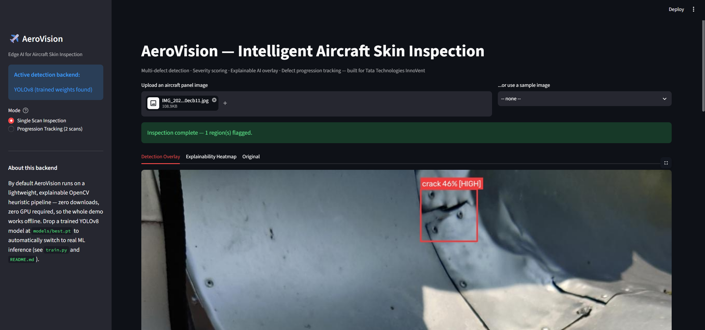
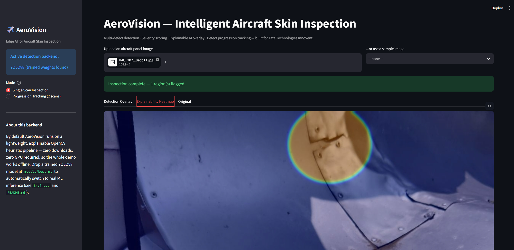
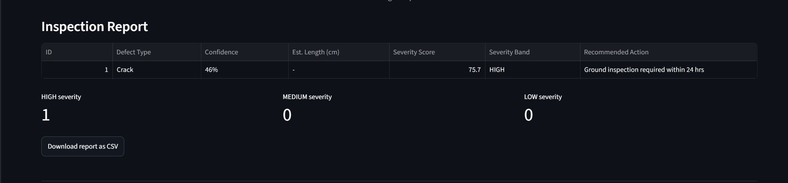
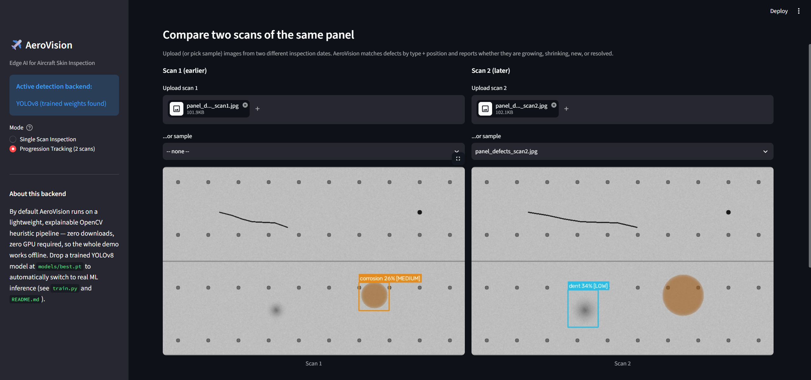
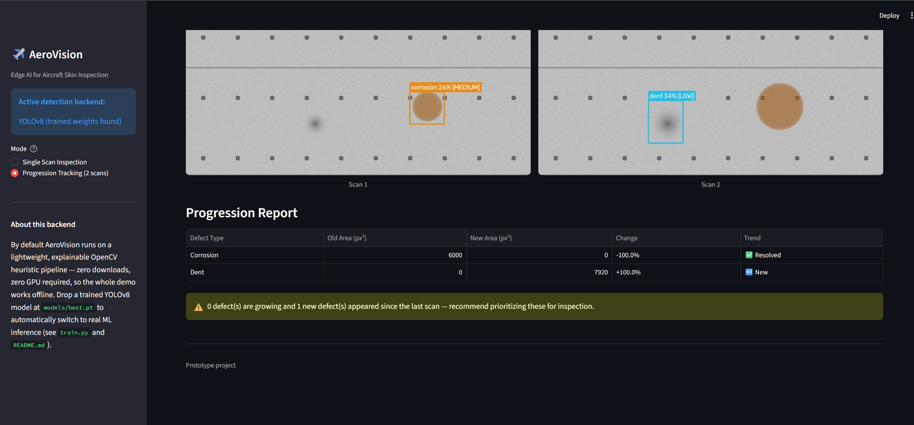

# AeroVision

**Edge AI for Intelligent Aircraft Skin Inspection & Defect Detection**
Built for Tata Technologies InnoVent — Aerospace Vertical

AeroVision is a working software prototype that inspects aircraft
panel images for multiple defect types (cracks, corrosion, dents,
rivet damage), scores each one's severity, explains *why* it was
flagged, and tracks whether defects are growing across repeated scans.

It runs completely offline out of the box — no dataset download, no
GPU, no internet required for the demo — using a lightweight,
explainable OpenCV detection pipeline. It also supports dropping in a
real trained YOLOv8 model for higher accuracy (see "Upgrading to a
trained ML model" below), which is exactly the upgrade path you'd
narrate in your presentation as "future enhancement / scalability".

---

## Features

- **Multi-defect detection** — crack, corrosion, dent, and rivet
  damage identified in a single pass
- **Severity + urgency scoring** — not just yes/no; each detection
  gets a 0–100 score, a LOW/MEDIUM/HIGH band, and a recommended action
- **Explainable overlay** — a heatmap shows *why* a region was
  flagged, not just a box
- **Defect progression tracking** — compare two scans of the same
  panel and see which defects are growing, shrinking, new, or resolved
- **Streamlit dashboard** — upload an image (or use bundled samples),
  see detections, download a CSV inspection report
- **Edge-ready architecture** — the classical backend needs no GPU at
  all; the optional YOLOv8-nano backend is small enough for
  Jetson/Raspberry-Pi-class hardware

---

## Quick Start (VS Code / local machine)

### 1. Clone / unzip and open in VS Code

Open the `aerovision/` folder in VS Code.

### 2. Create a virtual environment (recommended)

```bash
python -m venv venv

# Windows
venv\Scripts\activate

# macOS / Linux
source venv/bin/activate
```

### 3. Install dependencies

```bash
pip install -r requirements.txt
```

> If you only want the classical CV detector (no deep learning), you
> can comment out `ultralytics` and `torch` in `requirements.txt` —
> the app works fully without them.

### 4. (Optional) Regenerate the sample images

Sample synthetic panel images are already included in
`data/sample_images/`, but you can regenerate/customize them:

```bash
python generate_samples.py
```

### 5. Run the dashboard

```bash
streamlit run app.py
```

This opens the app in your browser (usually `http://localhost:8501`).
Pick a sample image from the dropdown or upload your own to see
detection in action. Switch to "Progression Tracking" mode in the
sidebar to compare two scans.

---

## Dashboard preview

The Streamlit dashboard (`app.py`) has two modes — Single Scan Inspection
and Progression Tracking — shown below with a screenshot of each view.

### Single Scan Inspection

An uploaded panel image gets flagged regions drawn directly on it, with
the defect type, confidence, and severity band:



The "Explainability Heatmap" tab shows *why* a region was flagged, instead
of just a bounding box:



Every flagged region also lands in a downloadable inspection report, with
severity score, band, and a recommended action per defect:



### Progression Tracking

Two scans of the same panel — upload both (or use bundled samples) — get
matched and compared side by side:



The progression report shows which defects grew, shrank, appeared, or
resolved between the two scans, with an urgency callout:



---

## Project Structure

```
aerovision/
├── app.py                     # Streamlit dashboard (main entry point)
├── generate_samples.py        # Creates synthetic demo images
├── train.py                   # Optional: train a real YOLOv8 model
├── requirements.txt
├── README.md
├── src/
│   ├── detector.py            # Core detection logic (classical CV + optional YOLOv8)
│   ├── severity.py            # Severity scoring rubric
│   ├── progression.py         # Scan-to-scan defect comparison
│   └── report.py              # Overlay drawing, heatmap, report table
├── models/
│   └── README.md              # Where to place trained YOLOv8 weights (best.pt)
├── docs/
│   └── screenshots/           # Dashboard screenshots used in this README
└── data/
    └── sample_images/         # Synthetic demo panel images
```

---

## How detection works

`src/detector.py` exposes one function, `detect(image)`, that returns
a list of `DefectDetection` objects. Internally it picks one of two
backends automatically:

| Backend | When it's used | How it works |
|---|---|---|
| **Classical CV** (default) | Always, unless a trained model is present | OpenCV heuristics: Hough line transform for cracks, HSV color masking for corrosion, black-hat morphology for dents, dark-blob detection for rivet damage |
| **YOLOv8** (optional) | Automatically, if `models/best.pt` exists | Real trained object-detection inference via `ultralytics` |

This means the project is demoable immediately, and upgrading to a
"real ML model" later is a drop-in change — you don't need to modify
`app.py` at all.

### Honest limitation of the classical backend

The classical detector is a heuristic baseline tuned against the
included synthetic sample images. On real aircraft photos it will
need re-tuning (thresholds in `src/detector.py` are clearly commented
and isolated per defect type) or, better, replacement with a trained
YOLOv8 model — which is exactly the story to tell judges: **Phase 1
(now) = explainable, dependency-free baseline; Phase 2 = trained
model for production accuracy.**

---

## Upgrading to a trained ML model

1. Get a labeled dataset (public defect-detection datasets — search
   Roboflow Universe / Kaggle for "aircraft defect", "metal surface
   defect", "corrosion detection", "crack detection")
2. Format it as a YOLO dataset (`train.py` docstring shows the exact
   folder structure + `data.yaml` format)
3. Train:
   ```bash
   pip install ultralytics torch
   python train.py --data path/to/data.yaml --epochs 60
   ```
4. Copy the resulting weights into the app:
   ```bash
   cp runs/detect/aerovision_defect_detector/weights/best.pt models/best.pt
   ```
5. Restart `streamlit run app.py` — it will now use YOLOv8 automatically.

---


---

## Notes on the sample images

`data/sample_images/*.jpg` are **synthetically generated** (via
`generate_samples.py`) stand-ins for real aircraft skin photos, so the
demo works without needing a licensed dataset. Replace them with real
inspection photos for your actual submission where possible — the
detector and dashboard work identically either way.
